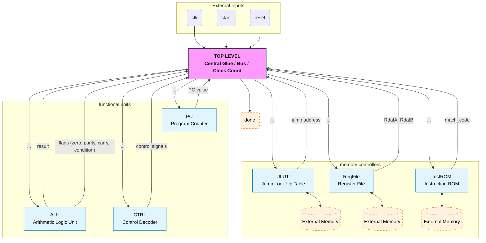

# Datapath & Components

The architecture is built around a centralized bus connecting the Control Unit, Register File, and ALU.

### Overview of the Datapath:

## Top-Level Connections

The `TopLevel` module coordinates the data flow between the Instruction ROM (`InstROM`) and the execution units.

* **Program Counter (PC):** Drives the address for the Instruction ROM.
* **Instruction ROM:** Outputs the 9-bit `mach_code` based on the PC.
* **Control Unit:** Decodes the `mach_code` into control signals for the ALU and Memory.

## The Accumulator Constraint

To fit instructions into 9 bits, the design uses an **Accumulator** pattern.

* **Constraint:** R-Type instructions do not specify a destination register.
* **Solution:** The Control Unit hardwires the Write Destination (`Wd`) and Read Address A (`Ra`) to `R0_ADDR` (0x0) for arithmetic operations.

## Component breakdown

### ALU (Arithmetic Logic Unit)

The ALU handles 4-bit operations including `ADD`, `SUB`, `AND`, `OR`, and Bitwise Shifts (`LSL`, `RSL`).

* **Parity Flag:** The ALU calculates parity (`^Rslt`) in real-time.
* **Branch Feedback:** The ALU outputs a dedicated `ALU_Condition_True` signal directly to the Control Unit and PC, enabling single-cycle branch decisions.

### Register File

* **Size:** 16 x 8-bit registers.
* **Special Handling:** `R0` is the dedicated accumulator. Immediate values (like constants) are often loaded directly into `R0`.
