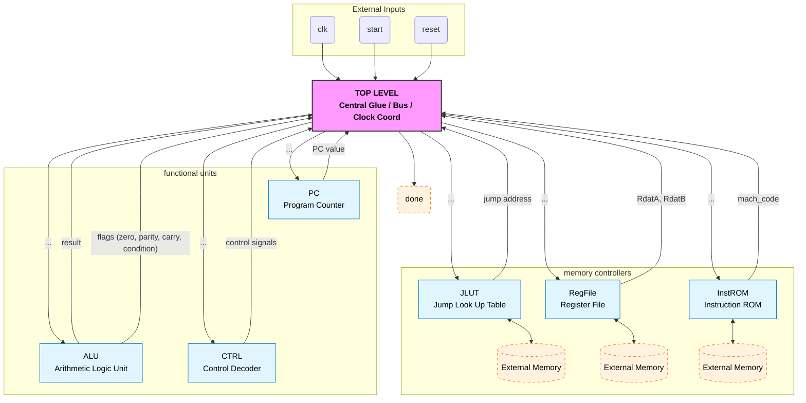
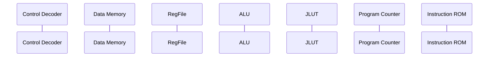
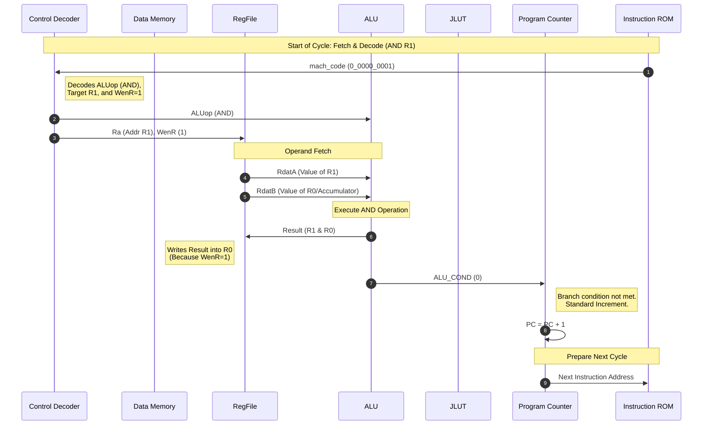
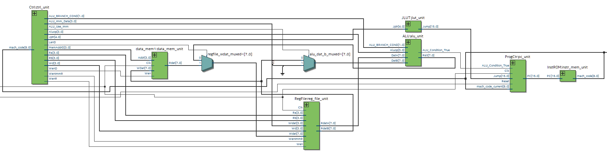

# Datapath & Components

The architecture is built around a centralized bus connecting the Control Unit, Register File, and ALU.

### Overview of the Datapath:

## Top-Level Connections

The `TopLevel` module coordinates the data flow between the Instruction ROM (`InstROM`) and the execution units.

* **Program Counter (PC):** Drives the address for the Instruction ROM.
* **Instruction ROM:** Outputs the 9-bit `mach_code` based on the PC.
* **Control Decoder:** Decodes the `mach_code` into control signals for the ALU and Memory.
* **ALU:** Executes arithmetic and logic operations based on the control signals and operands from the Register File.
* **Register File:** Provides the source operands for the ALU and receives results to be stored back.
* **Jump Look-Up Table (JLUT):** Provides target addresses for jump instructions, accessed by the Control Unit when needed.
* **Data RAM:** Stores data for load/store operations and intermediate results.
* **MUX:** Selects between different data sources based on control signals.

### Basic Components:

### Data Path `0_0000_0001` (AND R1):

Control Decoder first decodes the `mach_code` from the Instruction ROM, which is `0_0000_0001` for the `AND R1` instruction. It decodes the `ALUop` (the ALU operation code), sends it to the ALU; and the `Ra` address (R1 in this case), sends it to the Register File to read the value of R1; `WenR` (write enable for the Register File) is set to 1, indicating that the result from the ALU should be written back to the Register File.

Register File reads the value of R1 from its internal register array and sends it to the ALU as `RdatA`. Similarly, it reads the value of R0 (the accumulator) and sends it to the ALU as `RdatB`.

The ALU performs the AND operation between `RdatA` (value of R1) and `RdatB` (value of R0, the accumulator), and sends the `result` back to the Register File to be stored in R0 (muxed); and output the `ALU_COND` (branch condition met) flag to 0 to the Program Counter to indicate that the next instruction should be executed sequentially. 

The Register File takes the `result` as the data to be written back to R0, and updates its internal register array accordingly (since `WenR` is set to 1). 

The Program controller, since the `ALU_COND` flag is 0, increments the `PC` by 1 to point to the next instruction in the Instruction ROM for the next cycle.

The `mach_code` for the next instruction is fetched from the Instruction ROM based on the updated `PC`, and the process repeats for the next instruction.

### Data Path `10_00_0_1010` (BE R10):
this checks if the `R0` value is equal to the value in `R10`. If they are equal, the `ALU_COND` flag is set to 1, and the Program Counter will be updated to skip the next instruction (PC += 2). If they are not equal, the `ALU_COND` flag is set to 0, and the Program Counter will increment normally (PC += 1).

### Quartus Synthesis:

